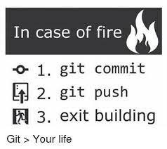
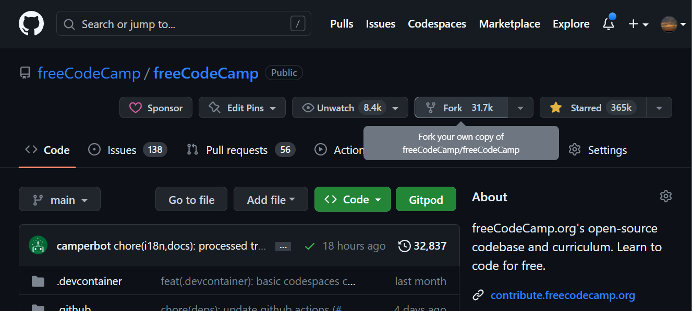

# Git Started

<div style="display:flex;justify-content:center;"></div>

```admonish caution
I am not an expert at Git. _Just ask my friends_ 🙄 I do get by, though.
```

## Contribute

### Forking

<div style="display:flex;justify-content:center;"></div>

### Cloning

```bash
git clone --depth=1 https://github.com/<USERNAME>/freeCodeCamp.git
```

<!-- prettier-ignore -->
~~~admonish example collapsible=true
```bash
git clone --depth=1 https://github.com/ShaunSHamilton/freeCodeCamp.git
```
~~~

### Upstreaming

To keep your fork up to date with the upstream repository, you need to add the upstream remote.

```bash
git remote add upstream https://github.com/freeCodeCamp/freeCodeCamp.git
```

Look what you did:

```bash
git remote -v
```

```admonish note
Often, it is recommended to use ssh instead of https. Something to keep in mind 🤷‍♂️
```

### Exploring

On freeCodeCamp, issues start off their life as `status: waiting triage`. This means a maintainer of the repository has not reviewed the issue to a point of concluding what it would take to close it.

Sometimes, issues require more discussion (`status: discussing`) before they can be triaged. This usually happens when it is not clear whether the point raised is something immediately actionable/desirable for the project.

Once an issue is triaged, it is often opened up to the community to contribute to. These issues are labelled `help wanted` or `first timers only`. Issues labelled `help wanted` are open to all, but usually require a bit more knowledge of the codebase than `first timers only` issues, and the maintainer comments on the related issue are not always as explicit about what needs to be done.

Find yourself an issue to contribute to: [Issues labelled `help wanted`](https://github.com/freeCodeCamp/freeCodeCamp/issues?q=is%3Aissue+is%3Aopen+label%3A%22help+wanted%22)

### Updating

Ensure you have the latest changes from the upstream repository:

```bash
# Ensure you are on the default/working branch
git checkout main
# Fetch the latest changes from the upstream repository
git fetch upstream
# Reset your local branch to the upstream branch
git reset --hard upstream/main
```

### Branching

Create a new branch for your contribution:

```bash
git checkout -b <BRANCH_NAME>
```

<!-- prettier-ignore -->
~~~admonish example collapsible=true
```bash
git checkout -b fix_too-much-sound
```
~~~

```admonish tip
The format I use for my branch names is: `<TYPE>_<DESCRIPTION>`

Where `<TYPE>` is one of: fix, feat, docs, chore, refactor, revert \
And `<DESCRIPTION>` is a kebab-case, easy to remember, description of the change
```

You may notice others using a forward slash instead of an underscore. This is fine, but confuses me when performing git ops like:

<!-- prettier-ignore -->
~~~admonish example title=""
```bash
git checkout remote/origin/fix/some-bug
```

Too many slashes 😱
~~~

### Committing

So, you have just made your awesome changes:

<!-- prettier-ignore -->
~~~admonish example title=""
```diff
- console.log('Hello, World!');
+ console.log('Hello, 🌍!');
```
~~~

```bash
# Add all changes to staging
git add .
git commit -m "<COMMIT_MESSAGE>"
```

<!-- prettier-ignore -->
~~~admonish example collapsible=true
```bash
git commit -m "fix(client): prevent sound on every render"
```
~~~

### Pushing

Push your changes to your fork, creating a new branch on your fork to follow:

```bash
git push -u origin <BRANCH_NAME>
```

<!-- prettier-ignore -->
~~~admonish example collapsible=true
```bash
git push -u origin fix_too-much-sound
```
~~~

Now, you can open a pull request from your fork to the upstream repository.

### Changing

A maintainer of the upstream repository may request changes to your contribution. You can make these changes on your local branch, and push them to your fork.

<!-- prettier-ignore -->
~~~admonish example title=""
```diff
- console.log('Hello, 🌍!');
+ console.log('👋, 🌍!');
```
~~~

```bash
git add .
git commit -m "<COMMIT_MESSAGE>"
git push
```

<!-- prettier-ignore -->
~~~admonish note title=""
Maybe you want to give credit to whoever suggested the change. You can do that by adding a `Co-authored-by` line to your commit message:

```bash
git commit -m "<SINGLE_LINE_MESSAGE>


Co-authored-by: <NAME> <<EMAIL>>"
```
~~~

<!-- prettier-ignore -->
~~~admonish example collapsible=true
```bash
git commit -m "emotify entire log message


Co-authored-by: Shaun Hamilton <51722130+ShaunSHamilton@users.noreply.github.com>"
```
~~~

```admonish warning
Pay attention to the two empty spaces between the commit message and the `Co-authored-by` line. This is important.
```
