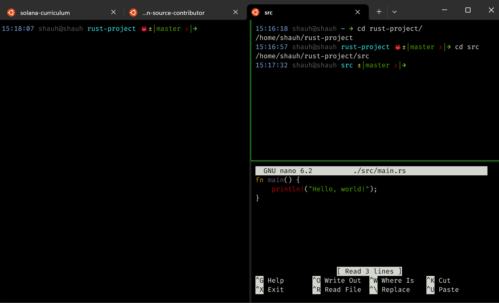
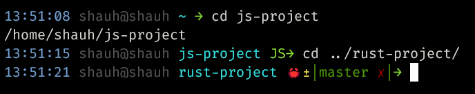

# Set Up

The tooling I use on my day-to-day.

## Operating System

 Windows 11

_Yes, I use Windows for software development as my primary workstation_ 🙄.

I have been using Windows since XP, and have become very comfortable with it. I tried my hand at Ubuntu, Lubuntu, Mint, Raspberry PiOS, and MacOS, but I always come back to Windows as my primary workstation.

## File System

 Ubuntu 22.04

<!-- prettier-ignore -->
```admonish quote title="&#x200b;"
What? I thought you said you use Windows? 🤔
```

Oh, right 😅. Did I forget to mention... I use WSL 2 on Windows 11 for my day-to-day development.

Windows Subsystem for Linux (WSL) is a compatibility layer for running Linux binary executables (in ELF format) natively on Windows 10 and Windows Server 2019. WSL provides a Linux-compatible kernel interface developed by Microsoft, which can then run Linux distributions in user mode on Windows [^1].

## Terminal

 Windows Terminal [^2]

Powershell is useful and all, but it is difficult to use most developer tools with it; the software world has just leant towards using UNIX-like shells. I have found connecting to WSL though Windows Terminal to be convinient, as Windows Terminal allows mulitple terminal sessions in tabs.



 Oh-My-Bash [^3]

I use Oh-My-Bash, which is a bash shell with a bunch of useful plugins and themes. Here is my current config: <https://gist.github.com/ShaunSHamilton/afe0f6c79fa10fcb5ea83436f98fa5b0>

The only custom bits are:

- The timestamp shown in the prompt
- The terminal tab title is set based on the directory I am in
- The prompt includes my silly emojis letting me know what kind of project I am working on



## Tools

### Node.js

Fortunately/Unfortunately, I have the luxury of being able to use Node.js for a lot of my work.

I install Node.js using Node Version Manager (nvm) [^4]:

```bash
curl -o- https://raw.githubusercontent.com/nvm-sh/nvm/v0.39.3/install.sh | bash
```

Once installed, I can install any versions of Node.js I want (except for `v999`):

<!-- prettier-ignore -->
~~~admonish example title="&#x200b;"
```bash
nvm install 1
nvm use 1
```
~~~

<!-- prettier-ignore -->
```admonish title="​&#x200b;​"
Do not actually install Node.js version `1`. It is just an example.
```

### Rust

<div style="display:flex;justify-content:center;"></div>

...but I usually do.

Rust is more than just a programming language or a compiler. It is a community of developers who are passionate about building fast, reliable, and efficient software.

```admonish tldr
Rust makes things go BRRRR!
```

#### `rustup`

With that community comes an ecosystem of tools. The brilliant thing about this ecosystem is that it is not the hodge-podge of tools that you find in the JavaScript ecosystem. The tools are all designed to work together, and they all work well together. Part of this is because the main tooling is developed by the same people who develop the language itself.

Which brings us to `rustup` - the Rust toolchain installer:

```bash
curl --proto '=https' --tlsv1.2 -sSf https://sh.rustup.rs | sh
```

Rustup handles installing `rustc` and `cargo`. `rustc` is the Rust compiler, and `cargo` is the Rust package manager.

<!-- prettier-ignore -->
```admonish summary title="&#x200b;"
`rustup` is to `rustc` is to `cargo` as `nvm` is to `node` is to `npm`.
```

### Docker Desktop

<div style="display:flex;justify-content:center;"></div>

[Docker Desktop](https://www.docker.com/products/docker-desktop/) is a tool for developers and sysadmins to develop, deploy, and run applications with containers. I use it to deplete my drive space with containers.

### MongoDB

<div style="display:flex;justify-content:center;"></div>

I guess if you program in JavaScript, you have to use MongoDB. I don't know why, but it is what it is. 🤷‍♂️

<!-- TODO: Discuss MongoDB in WSL -->

Setting up MongoDB on WSL can be a pain. In general, be sure to follow the [Install MongoDB on Ubuntu](https://www.mongodb.com/docs/manual/tutorial/install-mongodb-on-ubuntu/) docs.

<!-- prettier-ignore -->
```admonish note title="&#x200b;​"
If you decide to use a different Linux distro, be sure to follow the docs for that distro.
```

After following those docs, you _might_ be able to start MongoDB with:

```bash
mongod
```

More likely, you will get an error like:

<!-- prettier-ignore -->
~~~admonish error
```bash
{
  "t": {
    "$date": "2023-04-16T20:27:21.912+01:00"
  },
  "s":"E",
  "c":"CONTROL",
  "id":20557,
  "ctx":"initandlisten",
  "msg":"DBException in initAndListen, terminating",
  "attr": {
    "error": "NonExistentPath: Data directory /data/db not found. Create the missing directory or specify another path using (1) the --dbpath command line option, or (2) by adding the 'storage.dbPath' option in the configuration file."
  }
}
```
~~~

In which case, you would search this on the search engine of your choice: https://letmegooglethat.com/?q=mongodb+NonExistentPath%3A+Data+directory+%2Fdata%2Fdb+not+found.

You might see an answer like:

```bash
sudo mkdir -p /data/db
```

Trying again, you would see this error:

<!-- prettier-ignore -->
~~~admonish error
```bash
{
  "t": {
    "$date": "2023-04-16T20:32:24.033+01:00"
  },
  "s": "E",
  "c":"CONTROL",
  "id":20557,
  "ctx":"initandlisten",
  "msg":"DBException in initAndListen,
  terminating",
  "attr": {
    "error": "IllegalOperation: Attempted to create a lock file on a read-only directory: /data/db"
  }
}
```
~~~

In which case, you would do even more searching:

<div style="display:flex;justify-content:center;"></div>

Stumble upon something like:

<!-- prettier-ignore -->
~~~admonish info title="&#x200b;"
```bash
sudo chown $USER /data/db
```
~~~

Now, you should be able to start MongoDB:

<!-- prettier-ignore -->
~~~admonish success
```bash
mongod
```
~~~

---

[^1]: [WSL Documentation](https://learn.microsoft.com/en-us/windows/wsl/)

\

[^2]: [Windows Terminal](https://apps.microsoft.com/store/detail/windows-terminal/9N0DX20HK701)

\

[^3]: [Oh My Bash](https://ohmybash.nntoan.com/)

\

[^4]: [Node Version Manager](https://github.com/nvm-sh/nvm)
