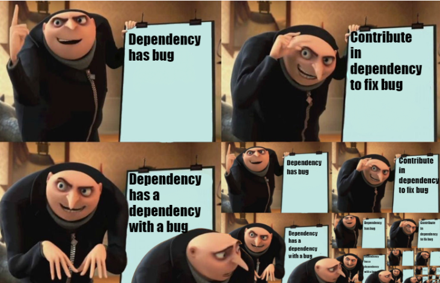

# Side Step

The beauty of the open-source community is evident in its _"I see, therefore I fix"_ attitude. This is often the best way to get started, and to **keep going**; whilst developing your own projects, you will inevitably come across bugs in the tools you use. Why not fix them?

## The Bug

Let's say you are working on a project, and you come across a bug 🐛 in a tool you use. You can either:

1. Ad-hoc fix the bug in just your own code
2. Use a different tool
3. Fork the tool, fix the bug, and use your fork
4. Contribute to the tool

```admonish hint
Pick option 4.
```

At the very least, it is worth checking the tool's issue tracker to see if the bug has already been reported. If it has, you can add a comment to the issue, or even better, you can submit a pull request to fix the bug.

<!-- prettier-ignore -->
~~~admonish example title="Example Time" collapsible=true
You are writing a certain book-like thing using [mdBook](https://rust-lang.github.io/mdBook/) bootstrapped with [mdbook-admonish](https://tommilligan.github.io/mdbook-admonish/overview.html).

Writing an admonish block has the following options:

````
```admonish note
Default with title="Note"
```
````

````
```admonish note title="Another Title"
Default with title="Another Title"
```
````

````
```admonish note title=""
No title is shown, and the cute little icon is not shown
```
````

🤔But you want no title, and you want the cure little icon to be shown. How do you do that?

A little bit of hacking, and you discover `title=" "` does not work, but `title="&#x200b;"` does. That is odd. A 🐛??

## The Report

After searching the issue tracker, you find that the bug has not been reported. So, you [open an issue](https://github.com/tommilligan/mdbook-admonish/issues/82).

The issue contains as much information as is relevant, and is polite and respectful. Including a code example or two goes a long way.

## The Fix

A maintainer of the project gets back with some actionable steps to close the issue. You decide to fix the bug, and [submit a pull request](https://github.com/tommilligan/mdbook-admonish/pull/83).

First, you should probably read any contributing guidelines the project has. Usually, these are located in a `CONTRIBUTING.md` file in the root of the repository, or mentioned in the `README.md`.

Then, you go through the whole [Git Started](./git-started.md) process again.

<div style="display:flex;justify-content:center;"></div>

~~~

## Overview

Contributing a fix to the software you use may not always be possible due to the scope of the bug, or the _aliveness_ of the project. However, it is worth trying, and is an excellent way to develop your developer skills.
